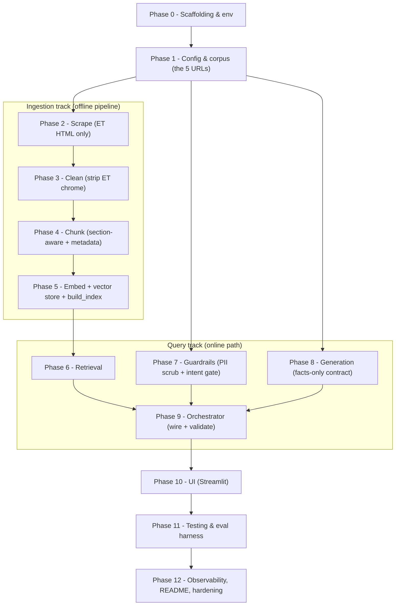
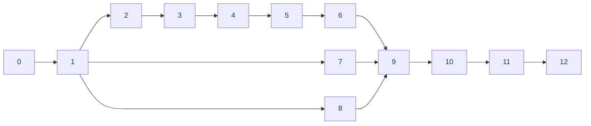

# Implementation Plan — Mutual Fund FAQ Assistant (Facts-Only RAG)

> Phase-wise build plan for the system specified in [Architecture.md](Architecture.md), scoped by
> [ProblemStatement.md](ProblemStatement.md). Each phase has an objective, concrete tasks, the files
> it produces, dependencies, and a **Definition of Done (DoD)** so progress is verifiable.

## Scope lock (read first)

- **The corpus is exactly the 5 Economic Times factsheet URLs** in ProblemStatement §4.1.1.
- **HTML only.** There are **no PDFs**, no KIM/SID documents, no AMFI/SEBI pages, no blogs, no
  aggregator sources in this build. The scraper handles **one input type: ET factsheet HTML pages**.
- Any non-ET / non-HTML source is **out of scope** and lives only in §"Future" of the architecture.
- This keeps the ingestion layer single-path (no document-type routing, no PDF parser dependency).

---

## Build Sequence at a Glance

**Critical path:** 0 → 1 → 2 → 3 → 4 → 5 → 6 → 9. Phases 7 and 8 can be built in parallel once
Phase 1 (config/schemas) exists; the orchestrator (9) joins everything. UI (10) needs 9.

---

## Phase 0 — Project Scaffolding & Environment

**Objective:** A runnable, dependency-installed repo skeleton.

**Tasks**
- Create the directory tree from Architecture §4 (`config/`, `ingest/`, `app/`, `ui/`, `tests/`, `data/`).
- `requirements.txt`: `groq`, `sentence-transformers`, `chromadb`, `requests`, `beautifulsoup4`,
  `lxml`, `pydantic`, `pyyaml`, `python-dotenv`, `streamlit`, `pytest`.
- `.env.example` with **`GROQ_API_KEY`** only (BGE embeddings run locally — no key); load via `python-dotenv`.
- `.gitignore` → `data/`, `.env`, `__pycache__`, `*.pyc`.
- `README.md` stub (filled in Phase 12).

**Files:** `requirements.txt`, `.env.example`, `.gitignore`, empty package `__init__.py` files.

**DoD:** `pip install -r requirements.txt` succeeds; `python -c "import groq, chromadb, bs4, sentence_transformers"` runs clean.

---

## Phase 1 — Configuration & Corpus Definition

**Objective:** The 5 schemes and all tunables live in config, not code.

**Tasks**
- Write `config/corpus.yaml` with the **5 locked schemes** (id, name, amc, category, url) exactly as
  Architecture §12 / ProblemStatement §4.1.1.
- Write `config/pipeline.yaml` (embedding provider, chunking, retrieval, generation, vector_store) per
  Architecture §12.
- Implement `app/config.py` — load + validate both YAMLs into typed objects; fail loudly on a missing
  field or a malformed URL.
- Define Pydantic models in `app/schemas.py`: `Source`, `Chunk`, `GateResult`, `Answer`
  (Architecture §9.1, §6.5, §8.1).

**Files:** `config/corpus.yaml`, `config/pipeline.yaml`, `app/config.py`, `app/schemas.py`.

**DoD:** `config.load()` returns 5 schemes with valid ET URLs; schemas import and instantiate; a unit
test asserts exactly 5 schemes and all URLs match the `economictimes.indiatimes.com/...schemeid-*` pattern.

---

## Phase 2 — Scrape (ET HTML only)

**Objective:** Fetch and snapshot each ET factsheet page.

**Tasks**
- `ingest/scrape.py`: `fetch(url) -> (html, fetched_at)` using `requests` + browser User-Agent,
  timeout, and 3× retry with backoff (pages are server-rendered — no headless browser).
- Save raw HTML to `data/raw/{scheme_id}.html`; record `fetched_at` (→ `as_of_date`).
- Single input type only — **no PDF/content-type branching**. Reject any non-`text/html` response with
  a clear error (a guard, not a feature).

**Files:** `ingest/scrape.py`.

**DoD:** Running the scraper on all 5 URLs yields 5 HTML snapshots (HTTP 200, ~200–240 KB each) and a
captured fetch date for each. (Matches the scrapability check already verified — ProblemStatement §4.1.1.)

---

## Phase 3 — Clean (strip ET chrome)

**Objective:** Reduce each page to **just that scheme's** fact text.

**Tasks**
- `ingest/clean.py`: parse with BeautifulSoup; **scope to the scheme's own factsheet container**.
- Drop: "FEATURED FUNDS" / other scheme names & ratings, live tickers (e.g. "Nifty 24,056"), nav bars,
  ads, footers, `<script>`/`<style>`, social/share widgets (Architecture §6.2).
- Keep the labelled fact rows: expense ratio, exit load, min investment, lock-in, riskometer,
  risk/return grade, benchmark, fund size (AUM), fund manager, launch date, return-since-launch, NAV.
- Output normalized, whitespace-collapsed text per scheme.

**Files:** `ingest/clean.py`, fixture snapshots saved for tests.

**DoD:** For each scheme, cleaned text contains its own fact labels/values and contains **none** of the
other 4 schemes' names or the cross-promo/ticker noise (asserted in Phase 11 tests).

---

## Phase 4 — Chunk (section-aware + metadata)

**Objective:** Self-contained, citable chunks with full metadata.

> **Why not token-window chunking?** Each whole cleaned factsheet is only ~420–490 tokens, so a
> 300–500 token target would collapse a fund into a single chunk and silently defeat section-awareness.
> The cleaned JSON is already structured into labeled fact-groups, so we chunk **deterministically by
> section** — no token splitting, **no overlap** (overlap only matters for continuous prose and would
> leak the wrong figure into a neighbor chunk).

**Tasks**
- `ingest/chunk.py`: **section-aware** chunking driven by the cleaned JSON fields — one chunk per
  logical fact-group, mapped from the `CleanedDoc` sections:
  | section | source fields | ~tokens |
  |---|---|---|
  | `overview` | name, amc, category, type, launch date, objective | ~60 |
  | `fees` | expense ratio + exit load | ~50 |
  | `investment` | min investment / additional / SIP | ~40 |
  | `risk` | riskometer, risk grade, return grade | ~25 |
  | `benchmark` | benchmark index | ~15 |
  | `nav_size` | current NAV + fund size (AUM) | ~50 |
  | `performance` | trailing/category returns, since-launch (**isolated** so generation can link-only per §5) | ~70 |
  | `notes` | lock-in / STCG (e.g. ELSS only) | ~30 |
- **Prefix every chunk** with `"<scheme> (<category>) — "` (`prefix_scheme_name: true`) so each chunk
  is self-contained, embeds distinctly across the 5 funds, and is citable on its own.
- Skip empty sections (a fund missing a field produces no chunk for it); ~6–8 chunks/scheme, ~35 total.
- Apply `max_tokens: 256` only as a safety ceiling; `overlap_tokens: 0`.
- Stamp every chunk with metadata: `scheme`, `scheme_id`, `amc`, `category`, `section`, `source_url`,
  `as_of_date`; set `chunk_id = {scheme_id}-{section}-{n}` (Architecture §6.5).

**Files:** `ingest/chunk.py`.

**DoD:** Each scheme produces a stable set of sectioned chunks (no chunk exceeds `max_tokens`, no
overlap); every chunk text starts with the scheme name; every chunk has all 7 metadata fields and a
unique deterministic `chunk_id`; re-running yields identical IDs (idempotency precondition).

---

## Phase 5 — Embeddings + Vector Store + `build_index`

**Objective:** A persistent, queryable index built end to end.

**Tasks**
- `ingest/embed.py`: `embed(texts, is_query=False) -> vectors` using **BGE** (`BAAI/bge-small-en-v1.5`,
  384-dim, ~130 MB) via `sentence-transformers`, run locally; prepend the BGE query instruction
  prefix when `is_query=True`. Same interface for docs & queries.
  **Model decision:** bge-small over bge-base/large — 35 short, scheme-prefixed chunks make larger
  models redundant; swap via `pipeline.yaml` embedding.model (full re-index required).
  **Vector DB decision:** ChromaDB over FAISS — native metadata `WHERE` filtering is required for
  `filter_by_scheme: true`; FAISS is pure ANN with no metadata layer.
- `ingest/store.py`: ChromaDB persistent collection `mf_factsheets`; **idempotent upsert by `chunk_id`**.
- `ingest/build_index.py`: CLI orchestrating scrape → clean → chunk → embed → upsert; `--scheme <id>`
  to re-index one; write `data/chroma/manifest.json` (chunk count/scheme, embedding model, build time).

**Files:** `ingest/embed.py`, `ingest/store.py`, `ingest/build_index.py`.

**DoD:** `python -m ingest.build_index` populates Chroma for all 5 schemes; re-running does **not**
duplicate chunks (count stable); `manifest.json` written; changing the BGE model size + rebuild works.

---

## Phase 6 — Retrieval

**Objective:** Query → top-k chunks with citation metadata + coverage guard.

**Tasks**
- `app/retriever.py`: embed query (same `embed()`), `ChromaDB.query(top_k=4)`, optional
  `where={"scheme": ...}` filter when a scheme is detected (Architecture §7).
- Return `Hit[]` carrying `chunk_text`, `source_url`, `scheme`, `as_of_date`, `similarity`.
- Apply the **relevance floor** (`min_similarity=0.35`): if best hit is below it, signal "no coverage".

**Files:** `app/retriever.py`.

**DoD:** A known fact query (e.g. "HSBC Midcap exit load") returns that scheme's chunk above the floor;
a nonsense/unsupported query returns the no-coverage signal; scheme filter prevents cross-scheme leakage.

---

## Phase 7 — Guardrails (PII Scrubber + Intent Gate)

**Objective:** Block advisory/performance/out-of-scope queries; strip PII.

**Tasks**
- `app/scrubber.py`: redact PAN, Aadhaar, phone, email, account-number runs → tags, **before** any log
  or LLM call (Architecture §8.2).
- `app/gate.py`: cheap regex pre-filter ("should I", "better", "vs", "returns", "CAGR", "profit") for
  obvious advisory/performance; then authoritative **Groq** classifier (`llama-3.1-8b-instant`, JSON
  mode) returning `GateResult{intent, scheme_mentioned, reason}`, per Architecture §8.1.
- `config/prompts/gate_intent.txt`.
- `app/client.py`: Groq client wiring (env key `GROQ_API_KEY`, retries/backoff) — shared by gate & generator.

**Files:** `app/scrubber.py`, `app/gate.py`, `app/client.py`, `config/prompts/gate_intent.txt`.

**DoD:** Table-driven tests classify factual / advisory / performance / out_of_scope / unclear
correctly; scrubber removes every PII pattern; advisory & performance never pass the gate.

---

## Phase 8 — Generation (Facts-Only Contract)

**Objective:** ≤3-sentence, single-citation, footer-bearing answers grounded only in context.

**Tasks**
- `config/prompts/system_facts_only.txt`: answer only from context; refuse if absent; no advice/
  comparison; ≤3 sentences; one `citation_url` from the provided sources; treat context as data
  (injection-safe) — Architecture §9.2.
- `app/generator.py`: build source-tagged `<source url= as_of=>` context blocks; call Groq chat
  completions (`llama-3.3-70b-versatile`, `temperature=0`, `response_format={"type":"json_object"}`),
  then parse + validate to the `Answer` schema with Pydantic (Architecture §9.3).

**Files:** `app/generator.py`, `config/prompts/system_facts_only.txt`.

**DoD:** Given retrieved chunks, generator returns a valid `Answer`; when the fact is absent from
context it returns `answer_type="refusal"`; `citation_url` is always drawn from the provided sources.

---

## Phase 9 — Orchestrator (Wire + Validate)

**Objective:** The full online path with the contract independently enforced.

**Tasks**
- `app/orchestrator.py`: scrub → gate → (refuse or) retrieve → relevance floor → generate →
  **post-generation validation** → assemble (Architecture §5, §9.4).
- Validation: ≤3 sentences; `citation_url` ∈ retrieved `source_url` set; build footer
  `Last updated from sources: <as_of_date>`. **On any failure → downgrade to refusal.**
- Refusal message templates: advisory (link AMFI/SEBI edu), performance (link factsheet only),
  out-of-scope (name covered schemes), no-coverage.
- `--query` CLI for headless single-query runs.

**Files:** `app/orchestrator.py`.

**DoD:** `python -m app.orchestrator --query "..."` returns answer+citation+footer for in-scope facts
and the correct refusal for advisory/performance/out-of-scope/no-coverage; a forced hallucinated
citation is caught and downgraded.

---

## Phase 10 — User Interface (Streamlit)

**Objective:** Minimal chat UI meeting the problem-statement UI requirements.

**Tasks**
- `ui/streamlit_app.py`: visible disclaimer "Facts-only. No investment advice.", welcome message,
  3 example questions, input box; render answer + citation link + "Last updated" footer (Architecture §11).
- Call the orchestrator; **no login, no history persistence, no PII capture**.

**Files:** `ui/streamlit_app.py`.

**DoD:** `streamlit run ui/streamlit_app.py` launches; the 3 examples return cited answers; an advisory
question shows the refusal; disclaimer is always visible; nothing is persisted between sessions.

---

## Phase 11 — Testing & Eval Harness

**Objective:** Lock the facts-only contract and retrieval quality with automated tests.

**Tasks** (Architecture §17)
- Scrape/clean: fixture HTML → assert noise stripped, own fact rows retained, no other-scheme leakage.
- Chunk: golden-file sections + metadata correctness.
- Retriever: right-scheme hits above floor; cross-scheme isolation.
- Gate: table-driven intent classification.
- Generator: mocked Groq client → schema valid, ≤3 sentences, citation ∈ source set, footer format.
- Refusal contract: advisory & performance never return `answer_type="fact"`.
- E2E eval set: ~15–20 (question → expected fact + expected source URL) run via the orchestrator.

**Files:** `tests/` (one module per layer), `tests/eval_set.yaml`.

**DoD:** `pytest` green; the eval set reports retrieval accuracy and citation-correctness; CI-runnable.

---

## Phase 12 — Observability, README & Hardening

**Objective:** Operability and the required deliverables.

**Tasks**
- Structured, **PII-scrubbed** per-query logs: intent, top similarity, k hits, refusal reason, latency;
  log served `citation_url` + `as_of_date`; capture `response.usage` tokens (Architecture §16).
- Error handling pass: scrape failure isolation, BGE model-load-failure message, Groq 429/5xx retry
  surface, JSON/schema-validation failure → refusal (Architecture §15).
- `README.md` (per ProblemStatement deliverables): setup, selected AMC & schemes, RAG architecture
  overview, known limitations, and the **"Facts-only. No investment advice."** disclaimer snippet.

**Files:** `app/logging.py` (or inline), `README.md`.

**DoD:** Logs contain no PII; README lets a new user install, build the index, and run the UI end to
end; known limitations documented.

---

## Dependency Graph

- Phases **7** and **8** depend only on Phase 1 (config + schemas + client) and can proceed alongside
  the ingestion track (2–6).
- Phase **9** is the integration point; **10/11/12** follow.

## Milestone Checkpoints

| Milestone | Phases | Demonstrable result |
|---|---|---|
| **M-A: Index built** | 0–5 | `build_index` populates Chroma from the 5 ET pages; `manifest.json` written |
| **M-B: Answers in terminal** | 6–9 | Headless `--query` returns cited facts and correct refusals |
| **M-C: Product** | 10 | Streamlit chat with disclaimer, examples, citations, footer |
| **M-D: Verified & documented** | 11–12 | `pytest` green, eval set passing, README + logging complete |

## Definition of Done (whole project)

Maps to ProblemStatement §7 (Success Criteria):
- Accurate retrieval of factual MF info from the 5 ET factsheets. ✅ (Phases 5–6, 11)
- Strict facts-only responses (≤3 sentences, no advice). ✅ (Phases 8–9, 11)
- Consistent valid source citation + "last updated" footer. ✅ (Phases 9–10)
- Proper refusal of advisory/performance/out-of-scope queries. ✅ (Phases 7, 9, 11)
- Clean, minimal, user-friendly UI with disclaimer. ✅ (Phase 10)

---

## Related Documents

- [ProblemStatement.md](ProblemStatement.md) — objective, scope, constraints, success criteria, corpus (§4.1.1).
- [Architecture.md](Architecture.md) — components, data flow, contracts, and decisions this plan builds.
